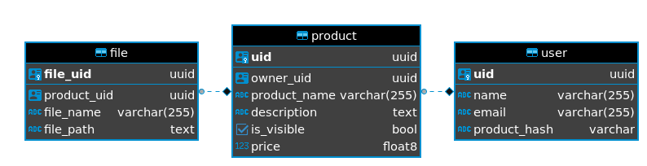

<!-- PROJECT LOGO -->
<br />
<p align="center">
  <a href="https://github.com/coolcom200/Artify">
    
  </a>

<h3 align="center">Artify</h3>

  <p align="center">
    A GraphQL Image Repository API
    <br />
    <a href="#api-details"><strong>Usage</strong></a> 
  </p>
</p>

<h2 style="display: inline-block">Table of Contents</h2>
<ol>
  <li><a href="#about-the-project">About The Project</a></li>
  <li><a href="#getting-started">Getting Started</a></li>
  <li><a href="#api-details">API Details</a></li>
  <li><a href="#discussion">Discussion</a></li>
  <li><a href="#things-to-improve">Improvements</a></li>
</ol>

## About The Project

This is a GraphQL API that is designed as a basic image repository. It enables
users to create an account and upload images and have them available for sale.
It's like Kijiji--only simplified.

The first version of this API utilized Elasticsearch as the database. However, a
PostgreSQL database has been added. As a result, the application is now designed
to work with two different database technologies.

### Built With

- [GraphQL](https://graphql.org/)
- [Ariadne](https://ariadnegraphql.org)
- [Flask](https://flask.palletsprojects.com/)
- [SQLAlchemy](https://www.sqlalchemy.org/)
- [Elasticsearch](https://www.elastic.co/elastic-stack)
- [PostgreSQL](https://www.postgresql.org/)

## Getting Started

### Prerequisites

This project requires the following tools:

- Docker
- Docker Compose

Please make sure that you have these installed.

### Installation & Starting the system

To clone this project run:

`git clone https://github.com/coolcom200/artify.git`

Navigate into the repository you just cloned and switch to the `graphql-sql`
branch: `git checkout graphql-sql`

To start the API, run: `docker-compose up`

Note: After starting the application wait around 30 seconds to ensure that every
service has started correctly. If the API starts before the database you might
see a few errors relating to connecting to the database. These should disappear
after a few requests are made.

Afterwards you can navigate
to [localhost:5000/graphql](http://localhost:5000/graphql)
to use the GraphQL playground. You can also learn more about the
API [here](#api-details)

## Configuration

Since this project has two different databases available, switching between the
two is handled using a configuration file. By default the API is using a
PostgreSQL database. In order to change the API to use Elasticsearch, the
following changes are required:

In the `api/config.json` file:

1. the `DATABASE_TYPE` needs to be changed to `elasticsearch`
2. the `DATABASE_HOST` needs to be changed to `elasticsearch` (
   since `elasticsearch` is the name of the docker-compose service running
   Elasticsearch)
3. the `DATABASE_PORT` needs to be changed to `9200`

In `docker-compose.yml` the `postgres` service can be commented out or removed
and in its place the `elasticsearch` service should be added:

```YAML
# docker-compose.yml
services:
   # ... Other services ...
   elasticsearch:
      image: docker.elastic.co/elasticsearch/elasticsearch:7.10.1
      container_name: elasticsearch
      environment:
         - discovery.type=single-node
      expose:
         - 9200
      volumes:
         - elasticsearch-data:/usr/share/elasticsearch/data

# The elasticsearch volume should also be added
volumes:
   elasticsearch-data:
      driver: local
```

In addition make sure to update the `web` service's `depends_on` details to
remove `postgres` and add `elasticsearch`
see [All services docker compose](#all-services-docker-compose) for
a `docker-compose.yml` file with all the database technologies

## API Details

[](https://app.getpostman.com/run-collection/c4861540b751a620558f)

The API is running on [localhost:5000/graphql](http://localhost:5000/graphql)
and has the GraphQL Playground enabled

#### :warning: Authentication

Since the application uses session cookie based authentication you should change
the playground settings to include credentials in requests. To do so click the
gear icon in the top right corner in the playground to open settings. Then find
the line with `"request.credentials": "omit"` and change it
to `"request.credentials": "include"`

If you choose to use cURl requests make sure to add the correct options to save
cookies such as `--cookie <cookie-jar file path>` to use a cookie jar for a
request and `--cookie-jar <cookie-jar file path>` to save cookies from a request
to the cookie jar file. Sample cURL requests have these options included.

Initially the application has no data and needs to be populated with some data.
To do so create an account and then create a product. Details for how to do so
are documented below.

### Register Mutation

Creates an account. An account is required to create products, and see your
products. Once you register your account you will get a session cookie and be
logged in.

```
mutation {
  register(
    input: { name: "My Name", email: "test@test.ca", password: "mypassword" }
  ) {
    message
  }
}
```

cURL:

```
curl --location --request POST 'http://localhost:5000/graphql' \
--cookie-jar cookies.txt \
--header 'Content-Type: application/json' \
--data-raw '{"query":"mutation {\n  register(\n    input: { name: \"My Name\", email: \"test@test.ca\", password: \"mypassword\" }\n  ) {\n    message\n  }\n}","variables":{}}'
```

### Login Mutation

To log into your account

```
mutation {
  login(input: { email: "test@test.ca", password: "mypassword" }) {
    message
  }
}
```

cURL:

```
curl --location --request POST 'http://localhost:5000/graphql' \
--cookie-jar cookies.txt \
--header 'Content-Type: application/json' \
--data-raw '{"query":"mutation {\n  login(input:{\n    email: \"test@test.ca\", password: \"mypassword\"}) {\n    message\n  }\n}","variables":{}}'
```

### Logout Mutation

To log out of your account

```
mutation {
  logout {
    message
  }
}
```

cURL:

```
curl --location --request POST 'http://localhost:5000/graphql' \
--cookie cookies.txt \
--header 'Content-Type: application/json' \
--data-raw '{"query":"mutation {\n  logout {\n      message\n  }\n}","variables":{}}'
```

### Create Product Mutation

The `createProduct` mutation is responsible for uploading images that are
associated with the product. I haven't found a way to upload images using the
Playground however it is possible using cURL
and [Postman](https://app.getpostman.com/run-collection/c4861540b751a620558f).
This is a protected endpoint so you will need to include cookies in the requests

cURL: Replace anything in the `input: {...}` with your own values, and an image
to upload. You can also change the `{ uid }` to be any selection of fields part
of the [Product](#graphql-schema) data type

Note you will likely need to login using the cURL
request [above](#login-mutation)
in order to populate the cookie-jar (cookies.txt). You could also use Postman to
login and then use the `createProduct` mutation.

```
curl --location --request POST 'http://localhost:5000/graphql' \
--cookie cookies.txt \
--form 'map="{\"0\": [\"variables.input.files.0\"]}"' \
--form '0=@"<PATH TO FILE>"' \
--form 'operations="{ \"query\":
\"mutation ($input: CreateProductInput!) { createProduct(input: $input) { uid } }\",
\"variables\": {
  \"input\": {
    \"files\": [null],
    \"productName\": \"<PRODUCT NAME>\",
    \"description\": \"<DESCRIPTION>\",
    \"price\": 0.00,
    \"isVisible\": true} } }"'
```

The mutation follows the specification defined in
https://github.com/jaydenseric/graphql-multipart-request-spec

### Search Query

To search for products. All parameters are optional. Available parameters
are: `minPrice`, `maxPrice` and `searchQuery`

```
{
  search(minPrice: 2) {
    productName
    owner {
      uid
    }
    price
    images {
      filePath
      fileName
    }
  }
}
```

cURL:

``` 
curl --location --request POST 'http://localhost:5000/graphql' \
--header 'Content-Type: application/json' \
--data-raw '{"query":"{\n  search {\n    productName\n    owner {\n      uid\n    }\n    price\n    images {\n      filePath\n      fileName\n    }\n  }\n}","variables":{}}'
```

### Me Query

To get information about the user. Must be authenticated.

```
{
  me {
    email
    uid
    name
    products {
      productName
    }
  }
}
```

cURL:

```
curl --location --request POST 'http://localhost:5000/graphql' \
--cookie cookies.txt \
--header 'Content-Type: application/json' \
--data-raw '{"query":"{\n  me {\n    email\n    uid\n    name\n    products {\n      productName\n    }\n  }\n}","variables":{}}'
```

### Download Image

To download an image from the API replace the `<FilePath>` with the `filePath`.
The
`filePath` can be found using the [Search Query](#search-query)

`curl 'http://localhost:5000/image/<FilePath>/' > out`

For example:
`curl 'http://localhost:5000/image/1b640668-ab4c-4db1-84f9-9698e2068dcc/' > out`

## Discussion

Ariadne, the GraphQL library, was chosen since it is a schema first library
meaning that in the future if this schema needs to be shared with other services
it can be done so in a simple manner. Since Ariadne was being used with Flask it
didn't have an official Flask GraphQL file upload handler, so I wrote one based
on the
[specifications](https://github.com/jaydenseric/graphql-multipart-request-spec)
and a similar handler that was included with Ariadne.

Adding support for multiple databases was tricky as it required custom data
models for Elasticsearch. In particular, the Elasticsearch model for a product
needed the ability to get the owner of the product. However, since the database
has two indices one for the users and another for the products and files, then
to get a product's owner would require querying the database for the owner. As a
result, I created custom data models that would query the database for missing
data.

Images that are uploaded are stored on the API server for demonstration
purposes. Once a file is uploaded, details about the file are added into the
database to track the file's official name and the path to the file. Currently,
the path to a file is just a randomly generated UUID which is sliced into a
directory structure. For example a file with
`filePath = 19ac0fea-fa27-4806-856f-57f0274d553e` could be sliced into the
following directory
structure: `1 > 9 > a > c > 0 > 19ac0fea-fa27-4806-856f-57f0274d553e`. The depth
is configurable in the `config.json`. This structure prevents all the files from
being stored in one massive folder and as a result can improve performance.

### Database Structure

For Elasticsearch there are two indices:

1. Users with the following mapping:

```json
{
   "name": {
      "type": "text"
   },
   "email": {
      "type": "keyword"
   },
   "password": {
      "type": "text",
      "index": false
   }
}
```

2. Products with the following mapping:

```json
{
   "product_name": {
      "type": "keyword"
   },
   "description": {
      "type": "text"
   },
   "owner_id": {
      "type": "keyword"
   },
   "is_visible": {
      "type": "boolean"
   },
   "price": {
      "type": "double"
   },
   "images": {
      // Images are stored per product
      "type": "nested"
   }
}
```

For PostgreSQL there are 3 tables that are shown in the diagram below.

 

## Things to Improve

- Support chunking uploads to allow very large files to be uploaded

- Use JWT to handle authentication instead of session cookies

- Pagination of results

- Add logging

- Add support for cloud based file storage providers such as S3

- Add unit tests

- Improve download security

- Improve the configuration

- Elasticsearch ORM

- Improved Error Messages

- Fix the isVisible option

- Deploy it!

## All services docker compose

```yaml
services:
   postgres:
      image: postgres:13-alpine
      restart: always
      environment:
         POSTGRES_PASSWORD: mysecretpassword
         POSTGRES_DB: artify_db
      expose:
         - 5432

   web:
      container_name: image-repository
      build: .
      working_dir: /code/api
      environment:
         - FLASK_APP=./
         - FLASK_ENV=development
      ports:
         - 5000:5000
      volumes:
         - ./:/code
      depends_on:
         - postgres
         - elasticsearch

   elasticsearch:
      image: docker.elastic.co/elasticsearch/elasticsearch:7.10.1
      container_name: elasticsearch
      environment:
         - discovery.type=single-node
      expose:
         - 9200
      volumes:
         - elasticsearch-data:/usr/share/elasticsearch/data

volumes:
   elasticsearch-data:
      driver: local
```

## GraphQL Schema

```graphql
scalar Upload

type File {
    filePath: String!
    fileName: String!
}

type Product {
    owner: User!
    productName: String!
    description: String!
    isVisible: Boolean!
    price: Float!
    uid: ID!
    images: [File!]!
}

type AuthResponse {
    message: String
}

type User {
    name: String!
    email: String!
    uid: ID!
    products: [Product!]!
}

type Query {
  search(searchQuery:String, minPrice: Float, maxPrice:Float): [Product!]!
  me: User!
}


input RegisterInput {
    name: String!
    email: String!
    password: String!
}

input LoginInput {
    email: String!
    password: String!
}

input CreateProductInput {
    productName: String!
    description: String!
    price: Float!
    isVisible: Boolean!
    files: [Upload!]!
}

type Mutation {
  logout: AuthResponse!
  login(input: LoginInput!): AuthResponse!
  register(input: RegisterInput!): AuthResponse!
  createProduct(input: CreateProductInput!): Product!
}
```
